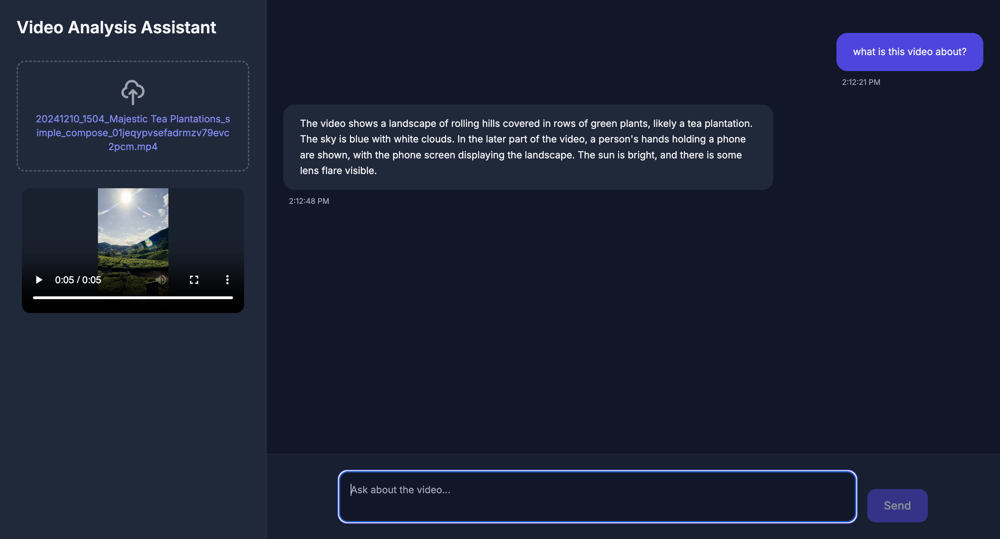

# Video Analysis Assistant w/ Gemini 2.0 Flash Exp

A web application powered by Google's latest Gemini 2.0 flash model that helps you analyze videos. Simply upload a video and chat with the AI to get detailed insights about its content.

## What it does

- Upload videos (MP4, MOV, AVI)
- Ask questions about the video content
- Get smart responses powered by Gemini 2.0 flash exp
- Real-time video analysis
- Clean chat interface

## Why Gemini 2.0?

This project uses Gemini 2.0 Flash, Google's most advanced multimodal model. It can:
- Understand video content in detail
- Process visual information frame by frame
- Provide accurate and contextual responses
- Handle multiple types of video analysis tasks

## Tech Stack

- Frontend: HTML, TailwindCSS, AlpineJS
- Backend: FastAPI, Python
- AI: Google's Gemini 2.0 (multimodal model)
